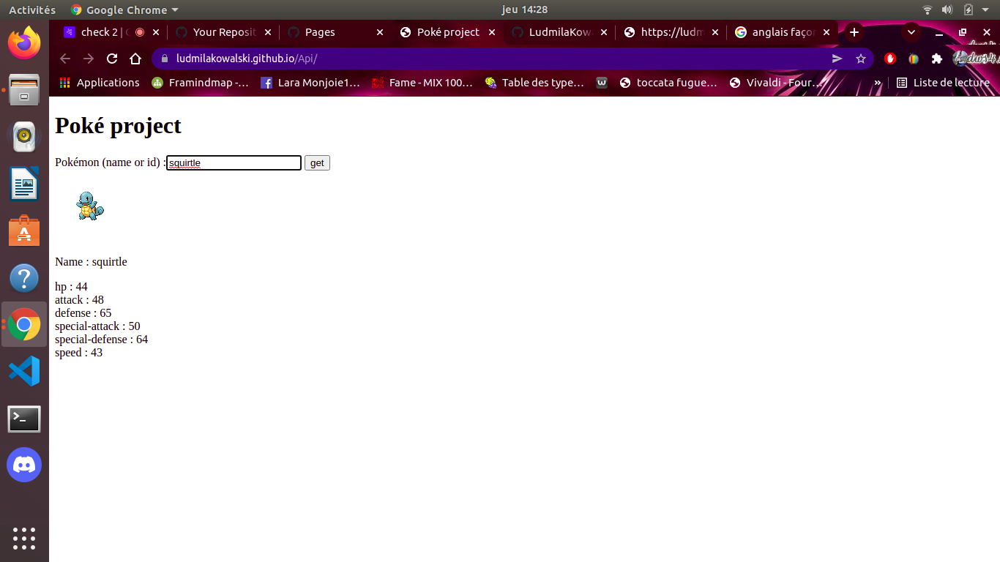
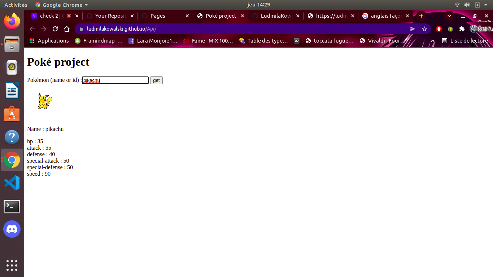

# Api-additional exercice

## Target

With a friend, we decided to created a website with an API. We want to train to use API, so we choose to create a pokedex.

## Techno

We used html and Javascript.

## Result

We can search pokémon with their name :

Or with their number into the pokedex :

## Link 

https://ludmilakowalski.github.io/Api/
